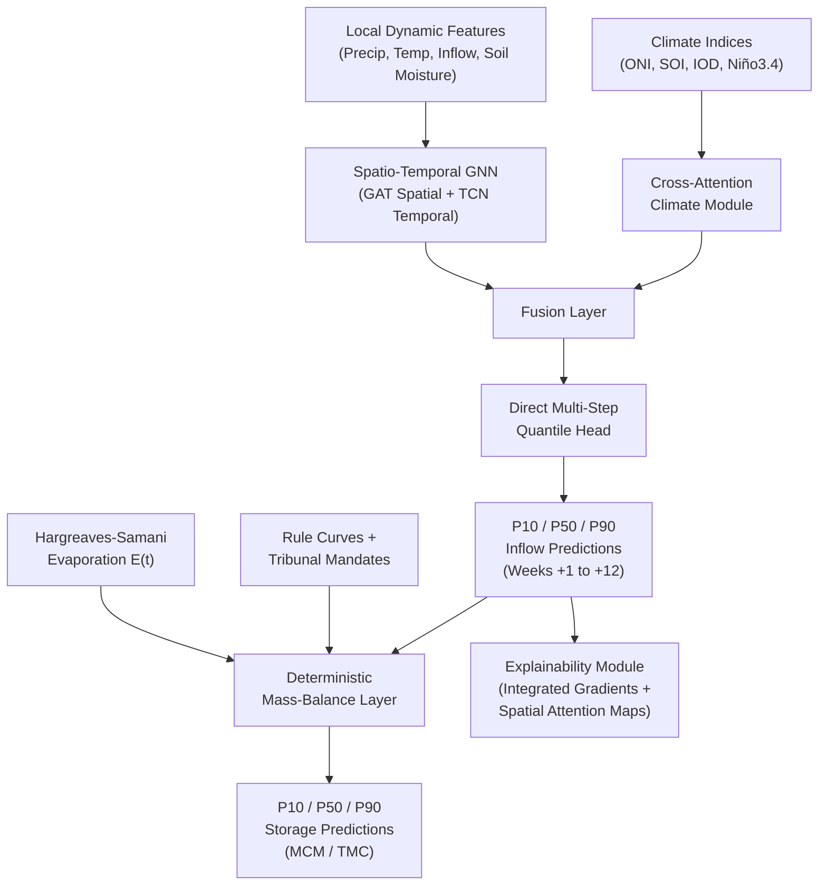
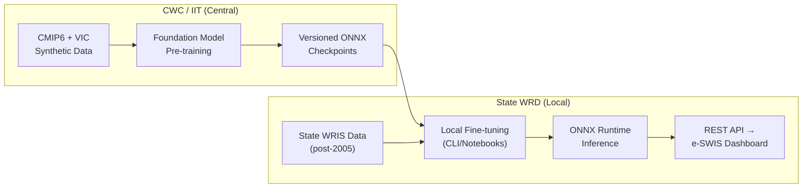

# Graph Neural Networks for Spatiotemporal Prediction of Major Reservoir Levels in Peninsular India during El Niño

## Final Approved Research Design
> **Disposition**: ✅ APPROVED by Integrator/Arbiter  
> **Review Process**: 5-agent structured design review (Primary Designer → Skeptic → Constraint Guardian → User Advocate → Arbiter)  
> **Revision Rounds**: 2 (16+ objections raised, all resolved)

---

## 1. Understanding Lock ✓

| Dimension | Specification |
|---|---|
| **Prediction Target** | Unregulated basin inflows (GNN) → Reservoir storage via deterministic mass-balance |
| **Spatial Scope** | ~50–100 major reservoirs in Peninsular India (south of Vindhyas): Krishna, Godavari, Cauvery, Pennar, Narmada, Tapi basins |
| **Temporal Scope** | Training: post-2005 observed (WRIS) + 100-year synthetic (CMIP6/VIC). Prediction: **2–12 weeks** (drought management) |
| **El Niño Dimension** | ENSO teleconnections with ISMR; El Niño → deficient rainfall → reduced inflows. Model captures lagged, non-linear ENSO×IOD interactions |
| **Target Users** | CWC, state irrigation/WRD departments, disaster management authorities |
| **System Positioning** | Medium-to-seasonal **drought management tool** (NOT real-time flood forecasting) |

---

## 2. Problem Formulation

Given a graph $\mathcal{G} = (\mathcal{V}, \mathcal{E}, W)$ where $\mathcal{V}$ represents $N$ reservoirs (nodes) and $\mathcal{E}$ encodes physical + climatological edges:

**Stage 1 — GNN Inflow Prediction:**
$$[\hat{I}_{q}^{(t+1)}, \dots, \hat{I}_{q}^{(t+H)}] = f_\theta(\mathcal{G}, X^{(t-T+1:t)}, S, C^{(t-T+1:t)}) \quad \text{for } q \in \{0.1, 0.5, 0.9\}$$

**Stage 2 — Deterministic Mass-Balance:**
$$S_{t+1} = S_t + I_t - E_t - R_t$$
where $R_t$ incorporates CWC rule curves and tribunal release mandates, and $E_t$ is computed via Hargreaves-Samani.

---

## 3. Graph Construction Strategy

### Nodes
~50–100 major dams in Peninsular India (Nagarjuna Sagar, Srisailam, Tungabhadra, Mettur, Jayakwadi, Sardar Sarovar, Almatti, etc.)

### Edge Types

| Edge Type | Direction | Construction | Weight |
|---|---|---|---|
| **Physical (Hydrological)** | Directed (upstream → downstream) | River network topology | Inverse travel time / flow distance |
| **Climatological** | Undirected | Historical seasonal rainfall cross-correlation (Pearson > 0.6) | Correlation magnitude |

> [!IMPORTANT]
> Climatological edges are **constrained to not bridge the Western Ghats orographic divide** unless meteorologically justified. This prevents GAT message-passing from aggressively smoothing features between meteorologically orthogonal catchments (windward vs. leeward).

---

## 4. Feature Engineering

### Node-Level Dynamic Features ($X$)
| Feature | Source | Resolution |
|---|---|---|
| Basin-averaged precipitation | IMD gridded | 0.25° × 0.25°, daily |
| Min/Max temperature | IMD gridded | 0.25° × 0.25°, daily |
| Soil moisture | ERA5-Land / satellite | ~9 km, daily |
| Historical observed inflow | India-WRIS / CWC | Daily |
| Current storage fraction | India-WRIS / CWC | Daily |

### Node-Level Static Features ($S$)
Catchment area, gross storage capacity, dead storage, elevation, CWC elevation-area-capacity curves

### Global Climate Drivers ($C$)
| Index | Source | Role |
|---|---|---|
| Oceanic Niño Index (ONI) | NOAA CPC | Primary ENSO indicator |
| Southern Oscillation Index (SOI) | NOAA CPC | Atmospheric ENSO component |
| Niño 3.4 SST anomalies | NOAA CPC | Pacific SST forcing |
| Indian Ocean Dipole (IOD) | BOM | Modulates ENSO impact on ISMR |

### Teleconnection Features
Lagged moving averages of ENSO/IOD indices at 1-month, 3-month, and 6-month lags to capture delayed oceanic forcing.

### Policy Constraints (Mass-Balance Layer inputs)
- CWC 10-daily rule curves (encoded as static temporal profiles)
- Interstate tribunal release schedules (e.g., Cauvery Water Disputes Tribunal, Krishna Water Disputes Tribunal awards)

---

## 5. Model Architecture

### Component Details

| Component | Implementation | Rationale |
|---|---|---|
| **Climate Interaction Module** | Cross-Attention between ENSO indices and IOD | Captures non-linear ENSO×IOD modulation (e.g., positive IOD buffering El Niño drought) |
| **Spatial Module** | Graph Attention Networks (GAT) | Dynamic neighbor weighting; attention can shift during anomalous ENSO states when normal spatial correlations break down |
| **Temporal Module** | Temporal Convolutional Networks (TCN) | Encodes past 90 days of local dynamics efficiently; dilated convolutions capture multi-scale patterns |
| **Prediction Head** | Direct Multi-Step (DMS) Quantile output | Predicts weekly/10-daily aggregated volumes for weeks +1 through +12 **directly** — no autoregressive unrolling, no error accumulation |
| **Mass-Balance Layer** | Fixed (non-trainable) physics: $S_{t+1} = S_t + I_t - E_t - R_t$ | Enforces physical conservation; incorporates policy/tribunal constraints; provides interpretable storage routing |
| **Evaporation $E(t)$** | Hargreaves-Samani equation + CWC capacity curves | Physics-based; uses readily available IMD temp forecasts; dynamic surface area from elevation-area-capacity curves |
| **Explainability Module** | Integrated Gradients + Spatial Attention Maps | Feature attribution ("78% due to rainfall deficit in upper catchment + elevated ONI") + visual basin-level attention heatmaps |

> [!NOTE]
> The Transformer encoder was removed from the temporal module. Long-range ENSO dependencies are now handled by the Cross-Attention Climate Module, keeping the temporal branch (TCN) focused on short-to-medium local dynamics. This reduces complexity.

---

## 6. Training Strategy

### Loss Function
$$\mathcal{L} = \underbrace{\sum_{q \in \{0.1, 0.5, 0.9\}} \mathcal{L}_{\text{pinball}}(q)}_{\text{Quantile Regression}} + \underbrace{\gamma(\text{ONI}) \cdot \mathcal{L}_{\text{asym}}}_{\text{Drought Penalty}}$$

- **Quantile Regression (Pinball Loss)**: Directly predicts P10, P50, P90 inflow scenarios
- **ONI-Conditioned Asymmetric Penalty**: $\gamma \approx 0$ during neutral/La Niña years; scales up when ONI > 0.5 (emerging El Niño). Prevents chronic under-prediction during normal years while heavily penalizing overestimation during droughts.

### Two-Phase Training

| Phase | Data | Purpose |
|---|---|---|
| **Pre-training** | 100 years of synthetic inflows from calibrated VIC hydrological model driven by CMIP6 historical climate runs | Embeds robust ENSO teleconnection physics; provides dozens of modeled ENSO cycles to overcome real-world sample starvation (~3 severe El Niños post-2005) |
| **Fine-tuning** | Observed India-WRIS data, strictly **2005–Present** | Adapts to real-world data characteristics, station-specific biases, and actual reservoir behaviors |

### Data Quality Pipeline
- Physical bounds enforcement (drop negative inflows, cap max plausible rainfall)
- Rolling median imputation for sensor dropouts
- Anomaly detection for telemetry spikes (0 or 9999 readings)

---

## 7. Evaluation Framework

### Metrics
| Metric | Purpose |
|---|---|
| **CRPS** (Continuous Ranked Probability Score) | Primary metric for probabilistic (quantile) forecast quality |
| **RMSE** (on P50) | Absolute accuracy of median prediction |
| **NSE / KGE** | Standard hydrological benchmarking |
| **Threshold Crossing Accuracy** | Categorical: "Will storage drop below 20% by date X?" — directly actionable for managers |

### Validation Strategy
- **Temporal hold-out**: Validate on **2014–2016** (severe El Niño 2015-16) and **2023–2024** (recent El Niño)
- **No random k-fold** (prevents temporal leakage)
- **Basin-level analysis**: Report per-basin performance to identify spatial weaknesses

### Baselines
| Baseline | Type |
|---|---|
| Historical climatological average | Naive |
| ARIMA / SARIMA | Statistical time-series |
| LSTM (non-spatial) | Deep learning without graph structure |
| Random Forest | ML ensemble |
| VIC / SWAT outputs | Physical hydrological model |

---

## 8. Deployment Architecture

### Centralized Foundation Model + Local Fine-Tuning

| Layer | Owner | Complexity | Update Cadence |
|---|---|---|---|
| **Foundation Model** (pre-training) | CWC / IIT partnership | High (VIC calibration, CMIP6 data, GNN training) | Annual or after major ENSO events |
| **Local Fine-tuning** | State WRD engineers | Low (`python finetune.py --state=karnataka`) | Quarterly or as new WRIS data accumulates |
| **Inference** | State WRD / automated | Minimal (ONNX runtime) | Real-time (daily batch) |

### Operational Output
- **Primary**: P10 / P50 / P90 inflow and storage volumes in **MCM / TMC** for weeks +1 through +12
- **Threshold Alerts**: "75% probability that live storage drops below critical drawdown level by [date]"
- **Explainability**: Integrated Gradients attribution + spatial attention basin maps alongside every forecast
- **Integration**: REST API endpoints consumable by existing **e-SWIS** government dashboards

---

## 9. Complete Decision Log

| # | Component | Decision | Alternatives Considered | Rationale |
|---|---|---|---|---|
| 1 | **Target Variable** | Predict unregulated inflows → Mass-balance for storage | Predict storage directly via GNN | Reservoir releases are governed by tribunal politics and rule curves, not learnable physics. GNN learns natural hydrology; mass-balance handles human intervention. |
| 2 | **Horizon & Scope** | 2–12 weeks only (drought management) | Include 1-7 day flood forecasting | ERA5 ~5-day latency and daily resolution incompatible with hourly gate operations. IMD data latency kills real-time use case. |
| 3 | **Graph Topology** | Dual-graph: Physical (directed) + Climatological correlation (undirected) | Pure physical; Pure spatial k-NN | Physical edges capture river connectivity; climatological edges capture shared meteorology without being misled by Western Ghats orographic shadow. |
| 4 | **Spatial Module** | Graph Attention Networks (GAT) | GCN; GraphSAGE | GAT dynamically adjusts neighbor influence — critical when ENSO breaks normal spatial rainfall correlations. |
| 5 | **Temporal Module** | TCN (90-day window) | TCN + Transformer; LSTM/GRU | Long-range ENSO dependencies handled by Cross-Attention Climate Module; TCN focuses on local temporal dynamics. Reduces complexity. |
| 6 | **Global Climate Integration** | Cross-Attention (ENSO × IOD) | MLP concatenation; Add as node features | MLP treats ENSO/IOD additively. Cross-Attention captures non-linear modulation (e.g., positive IOD neutralizing El Niño drought in 1997). |
| 7 | **Temporal Decoding** | Direct Multi-Step (weekly/10-daily chunks) | Autoregressive daily unrolling + teacher forcing | 90-day daily autoregressive = catastrophic error accumulation (exposure bias). DMS eliminates compounding errors. |
| 8 | **Data Strategy** | CMIP6/VIC synthetic pre-training + post-2005 fine-tuning | Train on full 1980–Present WRIS data | Pre-2000s WRIS data is patchy/interpolated. Synthetic pre-training provides 100 years with dozens of ENSO cycles, overcoming sample starvation. |
| 9 | **Loss Function** | Quantile Regression + ONI-conditioned asymmetric penalty | MSE + MAE + static asymmetric; Pure MSE | Quantile loss produces operational P10/P50/P90. Dynamic γ(ONI) prevents chronic conservatism in normal years. |
| 10 | **Uncertainty** | Quantile Regression (P10/P50/P90 volumes) | MC Dropout confidence intervals | MC Dropout produces artificially narrow CIs for tail-risk extremes. Users need discrete scenario volumes in MCM/TMC, not statistical variance. |
| 11 | **Evaporation E(t)** | Hargreaves-Samani + CWC capacity curves | Climatological average; Learned component | Physics-based, uses available IMD temp data, dynamically adjusts for reservoir surface area. Avoids adding model complexity. |
| 12 | **Explainability** | Integrated Gradients + Spatial Attention Maps | No explainability; SHAP (expensive) | Managers need attribution ("78% due to rainfall deficit + ONI") to justify decisions to superiors. Spatial attention maps provide intuitive basin-level visualization. |
| 13 | **Deployment Model** | Centralized foundation (CWC/IIT) + Local fine-tuning (State WRDs) | Monolithic system; Fully local | Heavy pre-training unmaintainable by WRD engineers. Split ensures sophistication without field breakage. |

---

## 10. Review Process Summary

| Phase | Agent | Key Contribution |
|---|---|---|
| Phase 1 | 🎨 **Primary Designer** | Initial ASTGCN design with dual-graph, TCN+Transformer, autoregressive prediction |
| Phase 2a | 🔴 **Skeptic/Challenger** | Identified 3 critical risks (data quality, tribunal politics, El Niño sample starvation), 3 significant concerns (orographic shadow, autoregressive drift, ENSO×IOD interaction), 3 minor issues |
| Phase 2b | 🛡️ **Constraint Guardian** | Rated 3 FAIL (performance, data feasibility, maintainability), 2 CONCERN (reliability, operational viability), 2 PASS (scalability, compute cost) |
| Phase 2c | 👤 **User Advocate** | Flagged black-box interpretability, P10/P50/P90 need, rule curve blindness, threshold crossing predictions, e-SWIS integration |
| Revision 1 | 🎨 **Primary Designer** | Accepted all 16+ objections; pivoted to inflow prediction + mass-balance, DMS, quantile regression, cross-attention, climatological edges |
| Phase 3 | ⚖️ **Integrator/Arbiter** | Declared REVISE: maintainability gap, E(t) unspecified, no explainability |
| Revision 2 | 🎨 **Primary Designer** | Added centralized/local deployment split, Hargreaves-Samani E(t), Integrated Gradients explainability |
| Phase 3 (Final) | ⚖️ **Integrator/Arbiter** | **✅ APPROVED** — all exit criteria met |
